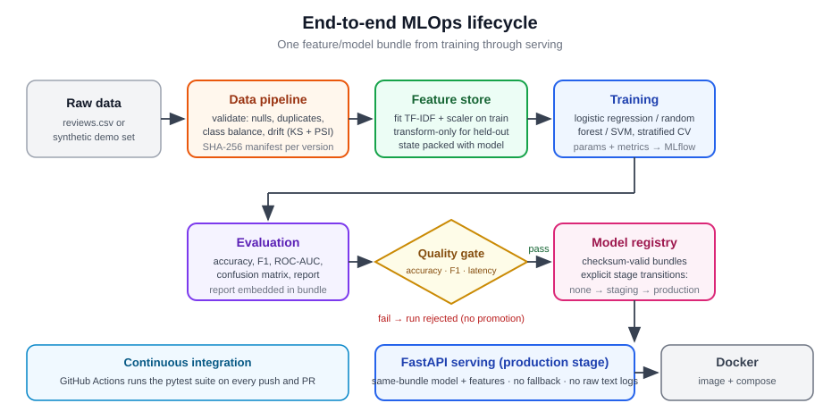

# MLOps End-to-End Pipeline

Training a model is the easy part. The hard part is everything around it: knowing which
data produced which model, refusing to ship one that does not meet the bar, and serving it
in a way you can reproduce next year.

This is a small, complete implementation of that lifecycle for a text-classification
task — data acquisition and validation, leak-free feature fitting, training, held-out
evaluation behind a promotion gate, immutable versioned artifacts, a serving API, a
container, and CI that runs all of it. It is deliberately small enough to read in an
afternoon.

[](docs/diagrams/pipeline.svg)

## Why it was built

Most "end-to-end ML" repositories demonstrate the tools and skip the contracts. This one
is organised around the contracts, because those are what break in production:

- preprocessing that was fitted on data the model should never have seen
- a quality gate that cannot actually refuse anything
- a model and its transformers drifting apart because they were saved separately
- a service that answers confidently with a model it failed to load
- a metric in a README that stopped being true six commits ago

Each of those has a specific mechanism here, and a test that fails if the mechanism stops
working.

## Quick start

Python 3.11.

```bash
git clone https://github.com/mzquadri/MLOps-End-to-End-Pipeline
cd MLOps-End-to-End-Pipeline

python -m venv .venv
source .venv/bin/activate          # Windows: .venv\Scripts\activate
pip install -r requirements.txt
```

## Reproduce the reference run

One command: acquire and validate data, train, evaluate against the gate, register, and
promote.

```bash
python -m src.pipeline --config configs/train_config.yaml
```

It downloads an 84 KB openly licensed dataset (verified against a pinned SHA-256, cached
in `data/cache/`), and writes `results/reference_run.json` plus a production bundle under
`models/registry/`. On a laptop it takes a few seconds.

Then serve it:

```bash
python -m src.serve --bundle_path models/registry/sentiment-classifier/v1 \
  --host 127.0.0.1 --port 8000

curl -s localhost:8000/ready
curl -s -X POST localhost:8000/predict \
  -H 'Content-Type: application/json' \
  -d '{"text": "this product is excellent and works great"}'
```

The individual stages remain available (`src.train`, `src.evaluate`, `src.model_registry`)
if you want to step through them.

Offline or in a hurry, `configs/ci_config.yaml` runs the same lifecycle on a synthetic
fixture with no network. Its metrics are meaningless by design — see below.

## Results

Reference run, UCI Sentiment Labelled Sentences, 3,000 rows split 1,800 / 600 / 600:

| | Validation | **Test** |
| --- | --- | --- |
| Accuracy | 0.8117 | **0.8067** |
| Weighted F1 | 0.8114 | **0.8067** |
| ROC-AUC | — | **0.8795** |
| PR-AUC | — | **0.8895** |
| Majority-class baseline | 0.5000 | **0.5000** |
| Margin over baseline | 0.3117 | **0.3067** |

Cross-validated weighted F1 on the training split: 0.7915 ± 0.0132. Single-row inference
latency, in process: p95 0.067 ms.

Read that as an ordinary result for TF-IDF plus logistic regression on short sentences —
well above the 0.5 baseline, and nowhere near a fine-tuned transformer. The value of this
repository is the machinery around the number, not the number.

`scripts/check_reference_run.py` asserts this table against an actual run, and CI runs it,
so the documentation cannot quietly drift away from the code.

**The synthetic fixture is not evidence.** It is built from ten templates and a linear
model scores ~1.0 on it. It exists so tests and CI can exercise the lifecycle without a
network. Nothing quoted as a result comes from it.

## Testing

```bash
pip install -r requirements-dev.txt

ruff check .
pytest -m "not docker"                     # 93 tests, ~13s
pytest tests/test_docker.py -m docker      # 6 tests, needs a Docker daemon
```

The container tests build the image, mount a real promoted bundle, wait for readiness and
make an actual HTTP prediction. See [docs/TESTING.md](docs/TESTING.md).

## Container

```bash
python -m src.pipeline --config configs/train_config.yaml   # produce a bundle first
docker compose up --build api
```

The image contains code and config only — no data, no model. A bundle is mounted at run
time, so promoting a new version does not require a rebuild. It runs as a non-root user,
and the healthcheck polls `/ready` using the interpreter already in the image rather than
a `curl` that the slim base does not ship.

## Repository structure

```text
src/datasets.py         dataset fetch, checksum verification, provenance records
src/data_pipeline.py    cleaning, validation and its failure policy, content hashing
src/feature_store.py    the only place anything is fitted; transform-only elsewhere
src/train.py            splitting, cross-validation, validation metrics, baseline
src/evaluate.py         held-out test metrics, curves, latency, the promotion gate
src/model_bundle.py     atomic writes, checksums, lineage and gate validation
src/model_registry.py   immutable versions and staging -> production transitions
src/serve.py            FastAPI service over exactly one production bundle
src/pipeline.py         the reference run, sequencing the stages above
scripts/                reference-run checker used by CI
configs/                train_config.yaml (licensed data) and ci_config.yaml (offline)
tests/                  99 tests across unit, integration and container layers
docs/                   architecture, data, evaluation, testing, production notes
```

## Design decisions

Six decisions carry most of the weight. Each is written up in
[docs/ARCHITECTURE.md](docs/ARCHITECTURE.md) with the problem it solves, the alternatives,
what could fail, how it is tested, and what would change in production.

1. **The bundle is the unit of promotion.** Model, transformers, metrics, lineage and
   evaluation move together or not at all, written atomically with a SHA-256 manifest.
2. **Only one function is allowed to fit.** `fit_transform_train` is the sole fitting
   entry point, which makes "no leakage" a property a test can check.
3. **Validation can refuse.** A degenerate dataset stops the run instead of producing a
   flattering score on it.
4. **The gate requires a margin over a baseline.** An accuracy floor alone means nothing
   without the class balance.
5. **The service starts unready rather than crashing.** `/health` is liveness, `/ready`
   is readiness and returns 503 until a model is genuinely usable.
6. **The reference run uses real, licensed data.** Downloaded and checksum-verified, never
   redistributed.

## Limitations

- A reference implementation, not a deployed product. No production traffic has ever hit
  it.
- 600 test rows, so the confidence interval on accuracy is roughly ±3 points. A one-point
  difference between models on this split is noise.
- Metrics are aggregate. The dataset pools Amazon, IMDb and Yelp; per-source performance
  is not reported and would very likely differ.
- Latency is measured in process on one machine — a regression guard, not a service level
  objective.
- No calibration is reported, because nothing consumes the probabilities as probabilities.
- Monitoring is a JSON counter endpoint, not a monitoring system.
- MLflow is optional and off by default. The bundle, not a tracking server, is the source
  of truth for promotion.

[docs/PRODUCTION.md](docs/PRODUCTION.md) covers what a production system would add and why
none of it is faked here.

## Documentation

| | |
| --- | --- |
| [ARCHITECTURE.md](docs/ARCHITECTURE.md) | Module boundaries and the six design decisions |
| [DATA.md](docs/DATA.md) | Dataset provenance, licensing, attribution, the fixture policy |
| [EVALUATION.md](docs/EVALUATION.md) | Split methodology, metrics, how the gate thresholds were derived |
| [MODEL_BUNDLES.md](docs/MODEL_BUNDLES.md) | Bundle format 1.1, promotion rules, trust boundary |
| [TESTING.md](docs/TESTING.md) | Test layers and the bugs each one exists because of |
| [PRODUCTION.md](docs/PRODUCTION.md) | Monitoring, serving and training gaps, stated plainly |

## License and data attribution

Code, configuration, tests and documentation: **MIT** ([LICENSE](LICENSE)). The scope of
that grant, and the third-party data terms below, are recorded in [NOTICE](NOTICE).

The dataset is **not** covered by that license and is not redistributed here. The
reference run downloads UCI *Sentiment Labelled Sentences*, licensed **CC BY 4.0**, which
requires attribution:

> Kotzias, D. (2015). Sentiment Labelled Sentences [Dataset]. UCI Machine Learning
> Repository. https://doi.org/10.24432/C57604 — licensed under
> [CC BY 4.0](https://creativecommons.org/licenses/by/4.0/).

## Author

**Mohd Zamin Quadri** — [GitHub](https://github.com/mzquadri) ·
[LinkedIn](https://www.linkedin.com/in/mohdzaminquadri/)
